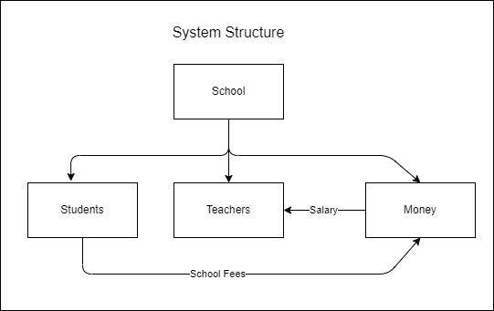

# School Management System

--- 
## About this project
This is a learning project to practice the baginner concepts of Java that I have learnt so far.

I follow a tutorial from youtube by [Rakshith Vasudev](https://www.youtube.com/@RakshithVasudev), which you can view [Here](https://www.youtube.com/watch?v=e0X00EoFQbE&list=PLXuLP_lLi2eBoYWqukzSuevdKxyFu-ZiT&index=22&ab_channel=RakshithVasudev)

## System structure:
System managing students, teachers and money coming in & out.

## Money:
---
- students total fees
- Fees paid
- teacher salary

## Teacher model:
---
- id 
- name
- salary

## Student model
---
- id
- name
- grade
- fees-paid
- fees-total

